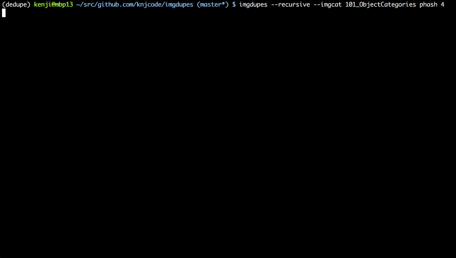

# imgdupes


Images by [Caltech 101] dataset that semi-deduped for demonstration.

`imgdupes` is a command line tool for finding and deleting duplicate and/or similar image files based on perceptual hash.  
You can delete duplicate image files with an operation similar to the [`fdupes`] command.  
It is better to pre-deduplicate identical files with [`fdupes`] in advance.


## For large dataset

It is possible to speed up dedupe process by approximate nearest neighbor search of hamming distance with [NGT].
See [Against large dataset](#Against_large_dataset) section for details.


# Install

To install, simply use pip:

```bash
$ pip install imgdupes
```


# Usage

Find a set of images with Hamming distance of phash less than 4.
(To search images recursively from the target directory, add `-r` or `--recursive` option.)

```bash
$ imgdupes --recursive target_dir phash 4
```

The set of images are sorted in ascending order of file size and displayed together with the pixel size of the image, you choose which image to preserve.

If you are using iTerm 2, you can display a set of images on the terminal with the `-c` or `--imgcat` option.

```bash
$ imgdupes --recursive --imgcat 101_ObjectCategories phash 4
```


# Against large dataset

`imgdupes` supports approximate nearest neighbor search of hamming distance with [NGT].

To dedupe images using NGT, run with `--ngt` option after installing NGT and python binding.

```bash
$ imgdupes --recursive --imgcat --ngt 101_ObjectCategories phash 4
```

For instructions on installing NGT and python binding, see [NGT] and [python NGT].


# Using docker containers with imgdupes

You can use `imgdupes` using a pre-build docker container.
[NGT] and [python NGT] is already installed in this container.

Clone imgdupes repository in advance and copy target directoris into imgdupes directory.

```
$ git clone https://github.com/knjcode/imgdupes
$ cd imgdupes
$ cp -r <target_dir> .
$ docker-compose run imgdupes -rc --ngt <target_dir> phash 4
```

When docker-compose is executed, current directory is mounted inside the container and referenced from imgdupes.


# Available hash algorithm

`imgdupes` uses the [ImageHash] to calculate perceptual hash.
You can use the same hash method as [ImageHash] library.

- [ahash]: average hashing
- [phash]: perception hashing
- [dhash]: difference hashing
- [whash]: wavelet hashing


# Options

`-r` `--recursive`

search images recursively from the target directory (default=False)

`-c` `--imgcat`

display duplicate images for iTerm2 (default=False)

`--num-hash-proc`

number of hash calculation processes (default=cpu_count-1)

`--ngt`

use NGT for calculating Hamming distance between hash of images (default=False)

`--ngt-k`

number of searched objects when using NGT.
Increasing this value, improves accuracy and increases computation time. (default=20)

`--ngt-epsilon`

search range when using NGT.
Increasing this value, improves accuracy and increases computation time. (default=0.1)

`--log`

output logs of duplicate and delete files (default=False)

`--cache`

create and use image hash cache (default=False)

`--size 256x256`

resize image (default=256x256)

`--space 0`

space between images (default=0)

`--space-color black`

space color between images (default=black)

`--tile-num 8`

space color between images (default=black)

`--no-keep-aspect`

do not keep aspect when displaying images

`--no-subdir-warning`

stop warnings that appear when similar images are in different subdirectories

`--dry-run`

dry run (do not delete any files)


# License

MIT

[`fdupes`]: (https://github.com/adrianlopezroche/fdupes)
[Caltech 101]: http://www.vision.caltech.edu/Image_Datasets/Caltech101/
[ImageHash]: https://github.com/JohannesBuchner/imagehash
[ahash]: http://www.hackerfactor.com/blog/index.php?/archives/432-Looks-Like-It.html
[phash]: http://www.hackerfactor.com/blog/index.php?/archives/432-Looks-Like-It.html
[dhash]: http://www.hackerfactor.com/blog/index.php?/archives/529-Kind-of-Like-That.html
[whash]: https://fullstackml.com/2016/07/02/wavelet-image-hash-in-python/
[NGT]: https://github.com/yahoojapan/NGT
[python NGT]: https://github.com/yahoojapan/NGT/tree/master/python
